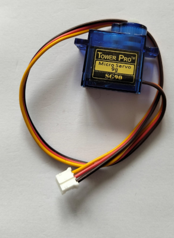

# TAPlab OTTO Robot Inventors Guild 2026

This project is part of the TAPlab NZ [https://www.taplab.nz/](https://www.taplab.nz/)

The young inventors are embarking on creating Otto robots and learning how to code.

The opensource version of OTTO is many years old and based on the Arduino UNO 8 bit micro controller. OTTO is now a commercial product owned by HP [https://hprobots.com/](https://hprobots.com/). The price of the starter kit is beyond what our tamariki can pay, particularly in NZ dollars.

We also believe that the OTTO should be open and available to all students.

*initial PCB design 19th May 2026

9 gram servo with JST-PH 2.0mm connector. This connector style has many advantages over the normal Dupont style connectors, IE not reversible and they lock into place. One challenge is converting a cheap Aliexpress servo to use JST, a local supply can perform this mod for $1 NZ each.

This is the same conversion HP do on the commercial Otto.

### Otto links

[https://www.ottodiy.com/](https://www.ottodiy.com/) Official Otto website.

[https://github.com/ottodiy](https://github.com/ottodiy) Github page.

